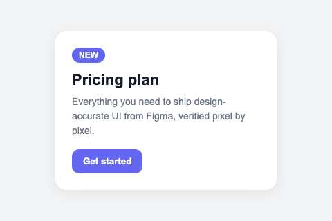
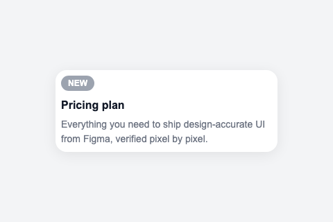
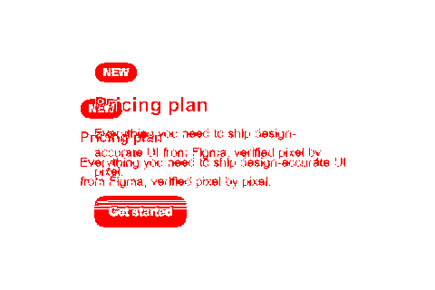

# figma-mcp

**Figma → code that is actually checked against the design.**

Most Figma-to-code tools stop at the moment of generation: they hand you JSX and
walk away. Nobody ever renders the output and compares it to the frame, so the
result stalls at "90% there" and you spend the afternoon nudging padding by eye.

This MCP server closes that loop. It converts a frame to self-contained HTML
**deterministically** (no LLM, no hallucinated layout), then renders your code in
Chromium, pixel-diffs it against the Figma reference, measures every element's
box, and tells the agent exactly what is missing or misplaced. The agent edits,
calls verify again, and repeats until the diff is at the anti-aliasing floor.

<table>
<tr>
<th align="center">Figma reference</th>
<th align="center">First pass — 5.18% off</th>
<th align="center">Pixel diff</th>
<th align="center">Converged — 0.00%</th>
</tr>
<tr>
<td></td>
<td></td>
<td></td>
<td></td>
</tr>
</table>

Those are real artifacts from `npm run example`, which runs the loop end to end
with no API key. The `generate` callback in that demo is a *scripted* stand-in
for an LLM, so it shows the loop mechanics honestly — the measuring is real, the
"model" is not.

## Why the verify step matters

A Figma node tree tells you what the designer *declared*. It does not tell you
what a browser will *do* with your CSS. Those diverge constantly — a flex gap
that collapses, a font that falls back, an absolute child that escapes its
parent. The only way to know is to render it and look.

`figma_verify` gives the agent three independent signals per pass:

- **Pixel diff** — the overall mismatch ratio plus the worst regions, so it knows
  *how* wrong and *where*.
- **Element bounding-box IoU** — every IR node is tagged `data-ir-id`, measured in
  the live DOM, and matched against its Figma box. This is what turns "the
  bottom-left looks off" into "the CTA button is missing" or "the price label is
  40px too low".
- **Paint order and clipping** — Figma lists children back-to-front, so a node's
  pre-order index *is* its paint order; `elementsFromPoint` over a sample grid
  gives the rendered order wherever two elements actually overlap. This catches
  the class of bug the other two signals are blind to by construction: elements
  present, in exactly the right box, stacked the wrong way round — or cut off by
  an ancestor's `overflow` where the design lets them overhang. Neither moves a
  box, and on a tall frame neither moves the diff ratio much, but a decorative
  overlay drawn over a photo instead of under it is the first thing a person
  sees. Reported as `WRONG STACKING` / `OVER-CLIPPED`, and reported even when the
  pixel diff has converged.

## Tools

| Tool | What it does | Network |
|---|---|---|
| `figma_convert` | Fetch a frame → self-contained HTML + `ir.json` + assets as data URIs + `reference.png`. Optional `react: true` (component + the `components/` it imports) and `next: true` (a runnable App Router project), plus a responsive variant. | Figma API (cached) |
| `figma_verify` | Render HTML in Chromium, pixel-diff vs the reference, IoU-check every element, check paint order and clipping, return targeted fix instructions. | none |
| `figma_inspect` | Print the IR as an indented outline (role, box, layout, text, tokens), filterable — read the structure without dumping raw Figma JSON into context. | none |

### Responsive output depends on what the design actually declares

`responsive: true` reads Figma's sizing intent — FILL becomes `flex`/`100%`, HUG becomes
`fit-content`, FIXED keeps its px. That only exists where the designer used Auto Layout.

A frame with **no** Auto Layout on the root is a canvas: every child is `position:absolute` at a
coordinate on a 1440px artboard. There is nothing to relax, so making the root `width:100%` does not
reflow it — the children stay pinned at their canvas coordinates and the right-hand side disappears
under `overflow:hidden`. That reads exactly like a page breaking when you zoom.

For those frames the converter keeps the exact canvas and scales it to the viewport instead, so the
design stays intact at every width and zoom level (down to 0.5x, after which the page scrolls).
`figma_convert` tells you which strategy it used. If you want real reflow rather than proportional
scaling, add Auto Layout in Figma — that is the signal the converter needs.

Every tool returns **file paths and numbers, never large blobs**. A converted
frame is often 100+ KB of HTML; pushing that through a tool result would burn the
agent's context for nothing. The agent reads and edits the files directly.

Figma responses are cached per frame, so after the first `figma_convert` the
whole loop runs offline and free — including when you are rate-limited.

## Quick start

You need a Figma personal access token: **Figma → Settings → Security → Personal
access tokens**, scope `File content: read`.

```bash
export FIGMA_TOKEN=figd_REPLACE_WITH_YOUR_TOKEN
```

Add it to Claude Code:

```bash
claude mcp add figma --env FIGMA_TOKEN=$FIGMA_TOKEN -- npx -y @mehmoodqureshi/figma-mcp
```

Or for any MCP host that reads a JSON config:

```json
{
  "mcpServers": {
    "figma": {
      "command": "npx",
      "args": ["-y", "@mehmoodqureshi/figma-mcp"],
      "env": { "FIGMA_TOKEN": "figd_REPLACE_WITH_YOUR_TOKEN" }
    }
  }
}
```

Then, in the agent: copy a frame link out of Figma (right-click the frame →
**Copy link to selection**) and say *"convert this frame and verify it until it
converges."*

### Windows

`npx` resolves to `npx.cmd`, which some MCP hosts cannot spawn directly. If the
server fails to start, point at the shim explicitly:

```json
{
  "command": "cmd",
  "args": ["/c", "npx", "-y", "@mehmoodqureshi/figma-mcp"]
}
```

## The loop, concretely

```
figma_convert  →  generated.html, reference.png, ir.json   (deterministic, no LLM)
      ↓
figma_verify   →  "NOT CONVERGED — 4.93% of pixels differ.
                   Elements: 22/26 match — 1 missing, 3 misplaced.
                   MISSING: button 'Get started'
                   MISPLACED: h1 'Pricing plan' — 6px too high"
      ↓
  agent edits generated.html
      ↓
figma_verify   →  "CONVERGED — 0.31% of pixels differ (threshold 2.00%)."
```

The refine loop runs **through the calling agent**, not through an LLM inside the
server. That means no `ANTHROPIC_API_KEY`, no second model billing, and the agent
keeps full context on what it already tried. A headless refine loop
(`src/refine/`) still exists for library use.

## Watch the loop without an agent

The same pipeline has a one-page local web front end, split in two: a chat on the
left, the generated app on the right. You send a frame link, it asks what to
build — HTML, React or Next.js; exact or responsive — and then converts, renders
and diffs in front of you. The right pane carries the running app, its source
files, the verify numbers and the pixel diff.

```bash
npm run site        # http://localhost:5173
```

It uses the same `.figma-token` and the same `.figma-cache/`, so a frame you have
already converted re-runs offline in about a second. Useful for checking a frame
converts cleanly before pointing an agent at it — and for showing someone what
"verified against the design" means rather than describing it. Details in
[`site/README.md`](site/README.md).

## Configuration

| Variable | Purpose |
|---|---|
| `FIGMA_TOKEN` | Required. Also read from a `.figma-token` file in your project directory. `FIGMA_API_KEY` is accepted as an alias. |
| `FIGMA_MCP_CACHE_DIR` | Where converted frames are cached. Defaults to `.figma-cache/` in the directory the server is started from. |
| `ANTHROPIC_API_KEY` / `GEMINI_API_KEY` | Optional, headless refine loop only. The MCP server never calls an LLM. |
| `FIGMA_MCP_SKIP_BROWSER_DOWNLOAD=1` | Skip the Chromium download on install. `figma_convert` and `figma_inspect` still work; `figma_verify` will not. |

See [`.env.example`](.env.example). Add `.figma-cache/` to your project's
`.gitignore` — a cached frame with embedded assets is tens of megabytes.

## What it does not do

Being straight about the edges, because they are Figma's, not bugs:

- **Design tokens resolve to literals unless you are on Enterprise.** The Figma
  Variables REST API is Enterprise-only. Without it, colors and spacing come out
  as exact values rather than `var(--color-surface)`. Everything else works.
- **Component *prop* bindings need Code Connect.** Components are matched by name
  and reported, but the API does not expose which instance prop drove which
  value.
- **The diff has a floor.** Anti-aliasing and font hinting keep the ratio around
  0.5–1.5% even on a perfect match. `threshold` defaults to 2% for that reason —
  chasing 0 is chasing rendering noise.
- **One frame at a time.** No whole-file crawling, by design: it keeps token
  spend and Figma rate-limit pressure predictable.

## Use it as a library

The verify loop is framework-agnostic and does not need the MCP layer:

```js
import { verifyLoop } from '@mehmoodqureshi/figma-mcp';
import fs from 'node:fs';

const result = await verifyLoop({
  initialCode: firstPassHtml,
  referencePng: fs.readFileSync('frame.png'),
  ir,                                   // enables element-level IoU findings
  viewport: { width: 1440, height: 900, deviceScaleFactor: 2 },
  threshold: 0.02,
  maxIterations: 5,
  generate: async ({ code, correction }) => callYourModel({ code, correction }),
});

console.log(result.converged, result.diffRatio);
fs.writeFileSync('diff.png', result.bestDiffPng);
```

The loop keeps the **best** iteration seen, so a later regression never makes the
result worse. To verify a React component on a dev server instead of an HTML
string, pass `render: () => renderUrl('http://localhost:3000/preview', viewport)`.

## Develop

```bash
git clone https://github.com/Mehmoodqureshi/figma-mcp.git
cd figma-mcp
npm install          # also downloads Chromium via postinstall
npm test             # full chain against a mocked Figma API — no token, no network
npm run example      # the verify loop end to end; watch the diff ratio fall
npm run serve        # run the MCP server on stdio
```

| Path | Role |
|---|---|
| `src/mcp/` | MCP server, Figma REST source, frame loading, asset export |
| `src/ir/` | Figma node tree → normalized IR (roles, boxes, auto-layout, style, tokens) |
| `src/codegen/` | IR → HTML / React / CSS |
| `src/render.js` `src/diff.js` `src/elementDiff.js` `src/paintOrder.js` | Playwright render, pixel diff, bounding-box IoU, z-order + clipping |
| `src/correction.js` `src/verifyLoop.js` | Turn a diff into fix instructions; drive the loop |
| `src/refine/` | Optional headless LLM refiners (Anthropic, Gemini) |
| `example/` | Runnable demos and the offline test suite |

`example/` doubles as the test suite — `npm test` runs the full
`loadFrame → figmaToIR → generateHtml` chain against a mocked Figma REST API,
including rate-limit handling and rotation/mirror transforms. No token, no
network, no browser, so it runs in CI on every push.

## License

MIT © Mehmood Ur Rehman Qureshi
